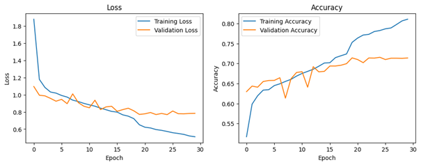
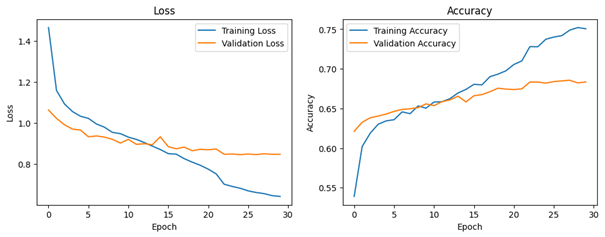
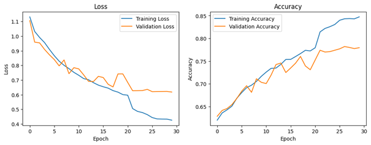
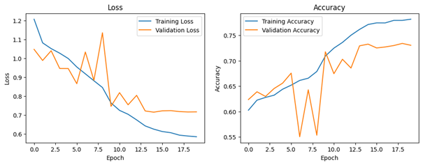

# CropDiseaseClassification

This project aims to classify crop diseases using deep learning architectures such as AlexNet, VGGNet, ResNet, and GoogleNet. The dataset used and the performance results of the models are included in this repository.

## Project Structure

- `models/`: Model architectures and weight files.
- `results/`: Results and comparison tables.
- `README.md`: Project description and guide.

## Performans Karşılaştırması

The performance comparison of the models is as follows:

| Model     | Accuracy | Precision | Recall | F1-Score |
|-----------|----------|-----------|--------|----------|
| AlexNet   | 0.7154   | 0.6916    | 0.7154 | 0.6946   |
| VGGNet    | 0.6820   | 0.6420    | 0.6820 | 0.6436   |
| ResNet    | 0.7327   | 0.7302    | 0.7327 | 0.7289   |
| GoogleNet | 0.7795   | 0.7726    | 0.7795 | 0.7751   |

## AlexNet Loss and Accuracy Graph

## VGGNet Loss and Accuracy Graph

## GoogleNet Loss and Accuracy Graph

## ResNet Loss and Accuracy Graph

